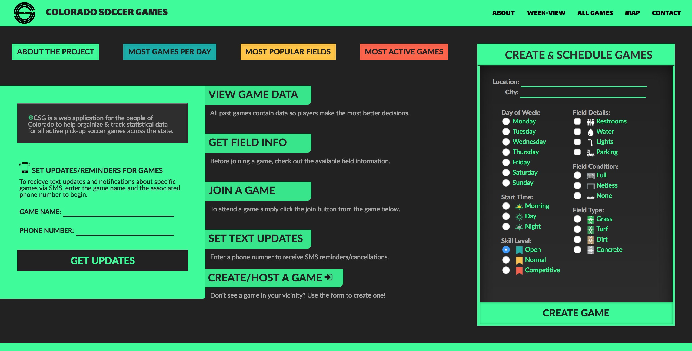

# Colorado Soccer Games - Web Application
* Web application for the people of Colorado to help organize & track data of active pick-up soccer games across the state.

### Author **Ben Csasalino**
### Contact **BenCasalino@gmail.com**

## Create Games Section
* Form to create and schedule a game.

## Weekly Games Section
* Shows what games are created for each day.

## Text Updates Games Section
* Section to enter phone number and recieve updates.

## Map Section
* Shows a map with markers for all scheduled games.

## All Games Section
* Displays all currently created games.

## Data - 1 Weekly Stats
* Displays game amounts per day of week.

## Data - 2 Most Popular Fields
* Displays total players per game.

## Data - 3 Most Active Games
* Displays total games completed.

## App Layout

- Link to: [Deployed front-end URL](https://coloradosoccergames.today/)
- Link to: [Code Frontend Repo](https://github.com/Colorado-Soccer-Games/client-csg)

- Link to: [Deployed back-end URL](https://protected-meadow-94841.herokuapp.com/)
- Link to: [Code Backend Repo](https://github.com/Colorado-Soccer-Games/server-csg)

## Tech Used
* VueJS, Javascript, SASS, Twilio, CSS, Knex, PostgreSQL, Postman, Node, Adobe Creative Suite, Express, Firebase, Heroku, Git/Github, Chart.js, Mocha, Chai, Agile
## Legal
Copyright (c) 2018 **_Benjamin M. Casalino_**

This software is licensed under the MIT license.

Permission is hereby granted, free of charge, to any person obtaining a copy
of this software and associated documentation files (the "Software"), to deal
in the Software without restriction, including without limitation the rights
to use, copy, modify, merge, publish, distribute, sublicense, and/or sell
copies of the Software, and to permit persons to whom the Software is
furnished to do so, subject to the following conditions:

The above copyright notice and this permission notice shall be included in
all copies or substantial portions of the Software.

THE SOFTWARE IS PROVIDED "AS IS", WITHOUT WARRANTY OF ANY KIND, EXPRESS OR
IMPLIED, INCLUDING BUT NOT LIMITED TO THE WARRANTIES OF MERCHANTABILITY,
FITNESS FOR A PARTICULAR PURPOSE AND NONINFRINGEMENT. IN NO EVENT SHALL THE
AUTHORS OR COPYRIGHT HOLDERS BE LIABLE FOR ANY CLAIM, DAMAGES OR OTHER
LIABILITY, WHETHER IN AN ACTION OF CONTRACT, TORT OR OTHERWISE, ARISING FROM,
OUT OF OR IN CONNECTION WITH THE SOFTWARE OR THE USE OR OTHER DEALINGS IN
THE SOFTWARE.